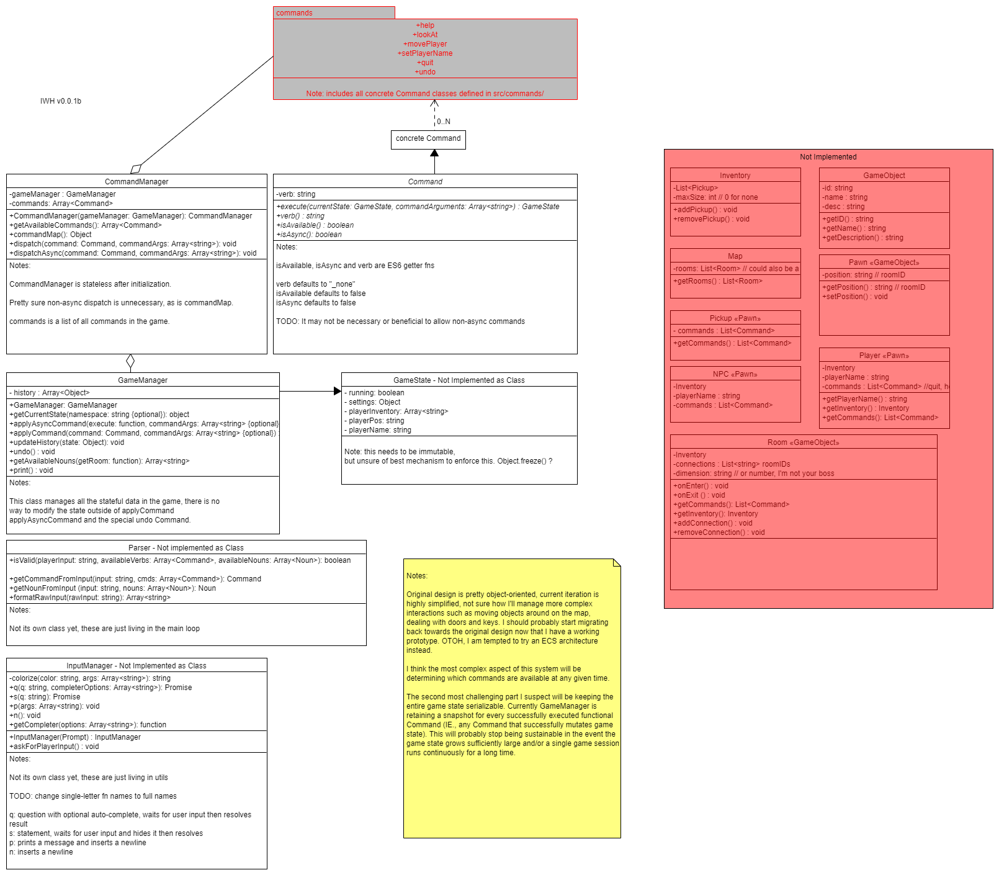

# IWHJS
A simple text adventure framework in NodeJS. 

**Note: the main branch of this repo is `main`**

## Instructions

IWHJS requires:

* [NodeJS](https://nodejs.org/en/download/) >= v10.0.0 
* [npm](https://docs.npmjs.com/about-npm/) (installs automatically with NodeJS)
* An terminal

### To Run Locally

In the root directory, run the following npm command:

`npm start`

### To Build

IWHJS uses [pkg](https://github.com/vercel/pkg) to build standalone executables for various platforms.

In the root directory, run the following npm command to build a Windows 10 compatible executable:

`npm install`

`npm run build`

The output will be in `./build`

## Class Diagrams

Current spec (v0.0.1b):

Original spec (v0.0.1):

Diagrams authored with [UMLetino](http://www.umlet.com/umletino/umletino.html)